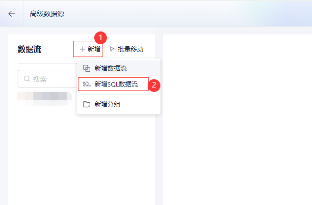

创建SQL高级数据源路径：`头像 -> 高级数据源 -> 新增 -> 新增SQL数据流`

!> PS：如果点头像，发现菜单栏没有「高级数据源」，或者点新增没有「新增SQL数据流」，请联系客服进行开通。





## SQL查询的超时时间

目前氚云在定义SQL页面的【校验查询】，和在仪表盘中引用SQL高级数据源查询的超时时间是相同的，都是11秒。

在使用该功能时请注意不要执行耗时过长的SQL查询，若业务逻辑确实需要，可以考虑新建一个表单作为中间表，由定时器（4小时执行一次，每次有20分钟执行时间）来生成中间表数据，然后仪表盘中直接查询中间表数据。


## 动态参数

SQL高级数据源支持动态参数，做法是在SQL语句中通过 `{字段名}` 来占位，例如下面SQL中的 `{Name}` 占位，就表示用 `Name` 字段来作为筛选条件：
``` sql
SELECT ObjectId AS `userId`, Name AS `userName`, State AS `state` FROM H_User WHERE State = 0 AND {Name}
```

在SQL中加入 `{字段名}` 占位符后，右边动态参数设置会自动出现该参数：


动态参数的参数类型、逻辑关系会影响最终SQL语句的生成，例如：
1. 如果参数类型是 `单行文本`，逻辑关系是 `等于`，那么生成的SQL语句就是 `字段 = '值'`；
2. 如果参数类型是 `数字`，逻辑关系是 `范围`，那么生成的SQL语句就是 `字段 BETWEEN 最小值 AND 最大值`；
3. 如果参数类型是 `日期`，逻辑关系是 `大于`，那么生成的SQL语句就是 `字段 > 值`；

保存后，在仪表盘中选择我们编写SQL高级数据源，动态参数会自动出现在仪表盘的筛选条件中：


## 常见问题

1. SQL高级数据源查询出来的数据，怎么控制数据权限？

由于使用SQL查询数据，已经脱离系统数据权限的控制，直接访问了数据库，所以需要通过SQL语句来控制数据权限。

例如再加一个拥有者 `OwnerId` 参数来控制数据权限：
``` sql
SELECT ObjectId AS `dataId`, Name AS `dataName` FROM i_表单编码 WHERE Status = 1 AND {Name} AND {OwnerId}
```

或者加一个所属部门 `OwnerDeptId` 参数来控制数据权限：
``` sql
SELECT ObjectId AS `dataId`, Name AS `dataName` FROM i_表单编码 WHERE Status = 1 AND {Name} AND {OwnerDeptId}
```

2. 可否在高级数据源中执行 `INSERT`、`UPDATE`、`DELETE` 语句？

不支持，如有执行这些语句的需求，请使用后端代码去执行[后端执行SQL](/docs/exec-sql)。

